# Penguin Health — System Architecture

A multi-tenant healthcare back-office platform on AWS. The system ingests behavioral-health charts via SFTP, OCRs PDFs through Textract, validates them against per-organization LLM + deterministic rules, materializes FHIR Encounter resources, runs real-time payer eligibility checks via Stedi, exposes the results in a React admin UI, and writes every PHI touch to a HIPAA-compliant WORM audit log. Everything is provisioned by a single CDK app (`infra/`) with one stack: `PenguinHealthStack` in `us-east-1`.

---

## 1. Top-level diagram

### Overview (start here)



Source: [architecture-overview.mmd](architecture-overview.mmd) · PNG: [architecture-overview.png](architecture-overview.png)

### Full resource-level diagram

For every Lambda, table, IAM-gated edge, and side-channel (cron rules, KMS, audit emits), the dense version is in [architecture.svg](architecture.svg) (open in a browser tab and zoom — it's wider than this page) with a PNG fallback at [architecture.png](architecture.png).

The Mermaid source for the full diagram is inlined below for in-editor preview.

```mermaid
flowchart LR
    %% ============== EXTERNAL ==============
    subgraph EXT[External actors]
        SFTP[SFTP partners<br/>orgs upload bulk CSV]
        Vendor[FHIR vendors<br/>Credible, etc.]
        StediAPI[Stedi 270/271<br/>eligibility]
        Payer[Payers via Stedi]
        Browser[Admin user<br/>browser]
    end

    %% ============== EDGE ==============
    subgraph EDGE["CloudFront + ACM (us-east-1)"]
        CF_APP[CloudFront<br/>AdminDistribution<br/>app.penguinhealth.io]
        CF_JWKS[CloudFront<br/>FhirJwksDistribution<br/>keys.penguinhealth.io]
    end

    %% ============== AUTH ==============
    subgraph AUTH[Identity]
        Cognito[(Cognito User Pool<br/>penguin-health-admin-pool<br/>custom:organization_id<br/>Admins group)]
    end

    %% ============== API ==============
    subgraph APIGW[API Gateway HTTP API v2]
        Routes["JWT-authorized routes<br/>/api/organizations/*<br/>/api/me/permissions"]
    end

    %% ============== LAMBDAS ==============
    subgraph LAMBDA[Lambda compute]
        AdminAPI[admin-api<br/>Py 3.14, 256MB, 60s]
        DeepWorker[deep-analytics-worker<br/>Py 3.14, 256MB, 10min]
        FhirPoller[fhir-eligibility-poller<br/>Py 3.13, 256MB, 10min]
        ProcessRaw[process-raw-charts-multi-org<br/>Py 3.14, 256MB, 15min]
        TextractHandler[textract-result-handler-multi-org<br/>Py 3.14, 512MB, 5min]
        CsvSplitter[csv-splitter-multi-org<br/>Py 3.14, 256MB, 60s]
        FhirMat[fhir-encounter-materializer<br/>Py 3.13, 512MB, 15min]
    end

    %% ============== FARGATE ==============
    subgraph FARGATE["Fargate + Step Functions"]
        RulesSFN[Step Functions<br/>penguin-health-rules-engine<br/>4h timeout, RUN_JOB sync]
        RulesTask[Fargate task<br/>penguin-health-rules-engine-runner<br/>Py 3.11, 2vCPU/4GB, private subnets]
        CRSFN[Step Functions<br/>penguin-health-centralreach-ingest<br/>600min timeout, RUN_JOB sync]
        CRTask[Fargate task<br/>penguin-health-centralreach-runner<br/>Py 3.11, 1vCPU/2GB, private subnets]
    end

    %% ============== EVENTS ==============
    subgraph EVT[EventBridge + SNS]
        SnsTextract[(SNS Topic<br/>penguin-health-notifications-multi-org)]
        EBPoller[EventBridge Rule<br/>fhir-eligibility-poller<br/>rate 15 min]
        EBMat[EventBridge Rule<br/>fhir-encounter-materializer<br/>SftpIngestComplete pattern]
        EBCron[EventBridge Rules<br/>per-org cron validation<br/>MON catch-up, TUE-FRI daily]
    end

    %% ============== STORAGE ==============
    subgraph DDB[DynamoDB]
        OrgCfg[(penguin-health-org-config<br/>pk/sk + gsi1<br/>RETAIN, PPR)]
        ValRes[(penguin-health-validation-results<br/>pk/sk + gsi1 + gsi2<br/>RETAIN, PPR)]
        Reports[(penguin-health-analytics-reports<br/>RETAIN, PPR)]
        DeepJobs[(penguin-health-analytics-deep-jobs<br/>TTL ttl, DESTROY)]
        Stedi[(penguin-health-stedi<br/>TTL expires_at, PITR<br/>gsi1=patient_hash<br/>RETAIN)]
        Audit[(penguin-health-audit<br/>KMS CMK, PITR<br/>TTL 90d, gsi1=patient<br/>RETAIN)]
    end

    subgraph S3STORE[S3]
        PerOrg[("penguin-health-{org_id}<br/>per-org PHI buckets<br/>data/, analytics/,<br/>textract-*/<br/>uploaded-data-sftp/<br/>athena-results/, agent-io/")]
        FrontBucket[("penguin-health-admin-ui<br/>SPA bundle, versioned")]
        AuditBucket[("penguin-health-audit<br/>Object Lock COMPLIANCE 7y<br/>KMS, versioned,<br/>deny destructive")]
        JwksBucket[("phealth-fhir-jwks<br/>public JWK Sets,<br/>OAC-only access")]
    end

    %% ============== ANALYTICS ==============
    subgraph ANALYTICS["Glue + Athena"]
        GlueDB1[Glue DB<br/>penguin_health_analytics]
        GlueDB2[Glue DB<br/>penguin_health_audit]
        WG[Per-org Athena workgroups<br/>penguin-health-analytics-{org_id}<br/>enforce_work_group_configuration]
    end

    %% ============== STREAMING ==============
    subgraph FH[Streaming + KMS]
        Firehose[(Kinesis Firehose<br/>penguin-health-audit<br/>DirectPut → Parquet via Glue<br/>60s/64MB buffer<br/>dynamic partitioning year/month/day)]
        AuditKey[KMS CMK<br/>alias/penguin-health-audit<br/>rotation enabled]
        FhirKeys[KMS asymmetric keys<br/>alias/penguin-health-fhir-*<br/>per-org sign-only]
    end

    %% ============== AI ==============
    subgraph AI[AI + secrets]
        Bedrock[Bedrock Runtime<br/>anthropic.* + inference profiles]
        Secrets[Secrets Manager<br/>penguin-health/stedi/*]
        SES[SES SendEmail<br/>noreply@penguinhealth.io]
        TextractSvc[Textract<br/>StartDocumentAnalysis FORMS]
    end

    %% ============== USER FLOWS ==============
    Browser -->|HTTPS| CF_APP
    CF_APP -->|default behavior| FrontBucket
    CF_APP -->|/api/*| Routes
    Browser -.->|SRP, ID/Access token| Cognito
    Routes -->|JWT verified by HttpJwtAuthorizer| AdminAPI

    %% Admin API outflows
    AdminAPI <-->|R/W + GSI Query| OrgCfg
    AdminAPI <-->|R/W + 2 GSIs| ValRes
    AdminAPI <-->|R/W| Reports
    AdminAPI <-->|R/W| DeepJobs
    AdminAPI <-->|R/W + gsi1| Stedi
    AdminAPI -->|GetSecretValue scoped| Secrets
    AdminAPI -->|InvokeModel| Bedrock
    AdminAPI -->|StartQueryExecution<br/>per-org workgroup| WG
    AdminAPI -->|GetTable, GetPartitions| GlueDB1
    AdminAPI -->|GetObject, PutObject<br/>athena-results/, agent-io/| PerOrg
    AdminAPI -->|InvokeFunction Event| DeepWorker
    AdminAPI -->|StartExecution<br/>manual run| RulesSFN
    AdminAPI -->|StartExecution<br/>manual ingest| CRSFN
    AdminAPI -->|verify| StediAPI
    AdminAPI -->|SES SendEmail| SES

    %% Deep worker — same surface as admin API
    DeepWorker <-->|R/W| DeepJobs
    DeepWorker -->|read| OrgCfg
    DeepWorker -->|InvokeModel + tool loop| Bedrock
    DeepWorker -->|run_sql tool| WG
    DeepWorker -->|GetTable/Partitions| GlueDB1
    DeepWorker -->|spill agent-io/| PerOrg

    %% Ingest pipeline
    SFTP -->|s3:PutObject<br/>uploaded-data-sftp/| PerOrg
    PerOrg -->|S3 ObjectCreated event| CsvSplitter
    CsvSplitter -->|writes data/{date}/<br/>archives source| PerOrg
    CsvSplitter -->|read| OrgCfg
    CsvSplitter -->|PutEvents<br/>SftpIngestComplete| EBMat
    EBMat -->|invoke| FhirMat

    %% PDF/Textract path
    PerOrg -->|polled list of<br/>textract-to-be-processed/| ProcessRaw
    ProcessRaw -->|StartDocumentAnalysis<br/>FORMS feature| TextractSvc
    TextractSvc -->|completion notification| SnsTextract
    SnsTextract -->|LambdaSubscription| TextractHandler
    TextractHandler -->|GetDocumentAnalysis| TextractSvc
    TextractHandler -->|write textract-processed/| PerOrg
    TextractHandler -->|read org chart_config| OrgCfg

    %% Rules engine
    EBCron -->|cron, per org input| RulesSFN
    RulesSFN -->|RunTask sync<br/>ORG_ID/RUN_ID/MODE/DATES| RulesTask
    RulesTask -->|R/W charts + Parquet| PerOrg
    RulesTask -->|read rules + chart_config| OrgCfg
    RulesTask -->|store findings + summaries| ValRes
    RulesTask -->|InvokeModel + crossregion profile| Bedrock
    RulesTask -->|SES SendEmail<br/>+ EMAIL_AUDIT# row| Stedi
    RulesTask -->|SES SendEmail| SES

    %% FHIR materializer
    FhirMat -->|read FHIR_CONFIG| OrgCfg
    FhirMat -->|kms:Sign + GetPublicKey<br/>private_key_jwt| FhirKeys
    FhirKeys -.->|public JWKS<br/>provision_fhir_keypair.py| JwksBucket
    JwksBucket --> CF_JWKS
    CF_JWKS -->|HTTPS| Vendor
    FhirMat -->|client_assertion<br/>fetch Encounter| Vendor
    FhirMat -->|StartQueryExecution<br/>per-org WG| WG
    FhirMat -->|GetTable/Partitions| GlueDB1
    FhirMat -->|write data/fhir/encounter/<br/>analytics/fhir/encounter/ Parquet| PerOrg
    FhirMat -->|InvokeFunction self<br/>continuation| FhirMat

    %% FHIR eligibility poller
    EBPoller -->|rate 15min<br/>per-org payload| FhirPoller
    FhirPoller -->|read STEDI_CONFIG, FHIR_CONFIG<br/>+ subscriber list| OrgCfg
    FhirPoller -->|R/W ENCOUNTER_ITEM, USAGE,<br/>FHIR_POLL_CURSOR + gsi1| Stedi
    FhirPoller -->|GetSecretValue<br/>penguin-health/stedi/api-key| Secrets
    FhirPoller -->|kms:Sign| FhirKeys
    FhirPoller -->|client_assertion<br/>Encounter+Patient search| Vendor
    FhirPoller -->|verify| StediAPI
    StediAPI -->|270/271| Payer
    FhirPoller -->|SES SendEmail<br/>+ EMAIL_AUDIT# row| Stedi
    FhirPoller -->|SES SendEmail| SES
    FhirPoller -->|PutMetricData<br/>PenguinHealth/FhirEligibilityPoller| CWMet[(CloudWatch<br/>Metrics + Logs)]

    %% Audit substrate — every emitting Lambda
    AdminAPI -.->|emit| AuditEmit{{audit.emit<br/>DDB PutItem sync<br/>+ Firehose PutRecord async}}
    DeepWorker -.->|emit| AuditEmit
    FhirPoller -.->|emit| AuditEmit
    ProcessRaw -.->|emit| AuditEmit
    TextractHandler -.->|emit| AuditEmit
    RulesEngine -.->|emit| AuditEmit
    CsvSplitter -.->|emit| AuditEmit
    FhirMat -.->|emit| AuditEmit
    AuditEmit --> Audit
    AuditEmit --> Firehose
    Firehose -->|Parquet via Glue schema<br/>year=/month=/day=| AuditBucket
    AuditBucket -.->|EXTERNAL_TABLE<br/>partition projection| GlueDB2
    AuditKey -.encrypts.-> Audit
    AuditKey -.encrypts.-> AuditBucket
    AuditKey -.encrypts.-> Firehose

    %% Permissions / outputs to CFN
    Cognito -.JWT claims include<br/>custom:organization_id +<br/>cognito:groups.-> AdminAPI

    classDef ext fill:#fef3c7,stroke:#92400e
    classDef store fill:#dbeafe,stroke:#1e3a8a
    classDef compute fill:#dcfce7,stroke:#166534
    classDef edge fill:#fae8ff,stroke:#86198f
    classDef sec fill:#fee2e2,stroke:#991b1b
    class EXT,SFTP,Vendor,StediAPI,Payer,Browser ext
    class DDB,S3STORE,OrgCfg,ValRes,Reports,DeepJobs,Stedi,Audit,PerOrg,FrontBucket,AuditBucket,JwksBucket store
    class LAMBDA,AdminAPI,DeepWorker,FhirPoller,ProcessRaw,TextractHandler,RulesEngine,CsvSplitter,FhirMat compute
    class EDGE,CF_APP,CF_JWKS edge
    class FH,Firehose,AuditKey,FhirKeys sec
```

---

## 2. Identity, edge, and the admin UI

### 2.1 CloudFront — `AdminDistribution`
- Origin 1 (default behavior): `penguin-health-admin-ui` S3 bucket via Origin Access Control. `CachingOptimized` policy. SPA fallbacks: 403/404 → `/index.html` with TTL=0 so React Router owns routing.
- Origin 2 (`/api/*`): `HttpOrigin` to `{httpApiId}.execute-api.us-east-1.amazonaws.com`. `CachingDisabled` + `AllVierwerExceptHostHeader` origin-request policy so the JWT and CORS headers pass through unmodified.
- Minimum TLS: TLSv1.2_2021. Viewer policy: REDIRECT_TO_HTTPS.

### 2.2 S3 — `penguin-health-admin-ui`
- BLOCK_ALL public access, S3-managed encryption, versioned, RETAIN. Built by `vite build` in `admin-ui/`, deployed via `scripts/admin-ui/deploy-frontend.sh`. CloudFront-OAC pulls assets.

### 2.3 Cognito — `penguin-health-admin-pool`
- Self-sign-up DISABLED. Sign-in by email. Password min 12, requires upper+lower+digit+symbol. Email-only recovery.
- Custom attribute `custom:organization_id`, **immutable** — only admins can set it via the Admin API.
- App client `penguin-health-admin-app`: SRP auth flow; ID + Access tokens 1h, refresh 30d. Tokens carry `email`, `cognito:groups`, and `custom:organization_id`.
- Group `Admins` — super admins who bypass org-scoped checks.

### 2.4 API Gateway HTTP API v2 — `penguin-health-admin-api`
- Authorizer: `HttpJwtAuthorizer` with issuer `https://cognito-idp.us-east-1.amazonaws.com/{poolId}` and audience = app client id.
- CORS: `*` origins, GET/PUT/POST/DELETE/OPTIONS, Authorization+Content-Type, 1h max-age.
- Single integration: `HttpLambdaIntegration` → `penguin-health-admin-api` Lambda.
- ~35 routes (full list in `infra/components/admin_ui.py` near line 603), grouped:
  - `/api/organizations[/{orgId}]` — org CRUD
  - `/api/organizations/{orgId}/rules{,/{ruleId}}` + `/rules-config` + `/rules/enhance-fields|enhance-note` — rule authoring + LLM helpers
  - `/api/organizations/{orgId}/analytics/nl-query[/deep[/{jobId}]]` + `/reports{,/{reportId}}` — natural-language analytics
  - `/api/organizations/{orgId}/validation-runs[/{runId}[/documents/{docId}{,/confirm-finding|mark-resolved|mark-incorrect}]]` — validation review
  - `/api/me/permissions` — caller's perms record
  - `/api/organizations/{orgId}/users{,/{email}}` + `/subscriptions{,/{email}}` — RBAC + email opt-ins
  - `/api/organizations/{orgId}/eligibility/verify|history|config|encounters{,/{id}/resolve|/rerun}` — Stedi + worklist

### 2.5 React SPA — `admin-ui/`
- Vite + React 18 + React Router. `AuthProvider` (`amazon-cognito-identity-js`) extracts claims from the ID token (email, groups, `custom:organization_id`, `isSuperAdmin`).
- `ProtectedRoute` / `RoleGuard` gate routes by `requireSuperAdmin` and `requireOrgAdmin` flags. **Front-end checks are advisory** — backend re-authorizes on every call.
- Pages: organizations list, org detail, rule editor/creator, validation runs + run detail, audit rules, validation results, analytics hub + saved reports, dashboard, users, eligibility (verify + worklist + census redirect), notification preferences.
- API client (`src/api/client.js`) injects the ID token; 401 → forced logout via `setOnUnauthorized` hook.

---

## 3. Storage

### 3.1 DynamoDB tables (all in `database.py` except `penguin-health-audit`)
| Table | Keys / GSIs | Notable settings | Purpose |
|------|------|------|------|
| `penguin-health-org-config` | pk/sk + gsi1 | PPR, RETAIN | Org metadata, validation rules (`RULE#{id}`), chart configs, USER#email permissions, STEDI_CONFIG, FHIR_CONFIG, SUBSCRIPTION items (gsi1pk=SUBSCRIPTION) |
| `penguin-health-validation-results` | pk/sk + gsi1 + gsi2 | PPR, RETAIN | One row per (run, document, rule). GSIs let API query by run / by org / by doc |
| `penguin-health-analytics-reports` | pk=ORG#{org_id}, sk=REPORT#{ts}#{id} | PPR, RETAIN | Saved NL-analytics snapshots. Newest-first via `ScanIndexForward=False` |
| `penguin-health-analytics-deep-jobs` | pk=ORG#{org_id}, sk=JOB#{id} | TTL=`ttl` (24h), DESTROY | Async deep-analysis job rows; self-clean |
| `penguin-health-stedi` | pk/sk + gsi1=patient_hash | TTL=`expires_at`, **PITR ON**, RETAIN | Mixed-purpose row types — see below |
| `penguin-health-audit` | pk/sk + gsi1=patient_hash | TTL=90d, **KMS CMK**, **PITR ON**, RETAIN | Hot mirror of audit events |

**`penguin-health-stedi` row types** — (legacy AUDIT# rows kept until ~mid-2032, new emits land on `penguin-health-audit`):
- `sk=AUDIT#{iso_ts}#{request_id}` — LEGACY, 7y TTL, no new writes
- `sk=USAGE#{yyyy-mm-dd}` — daily Stedi cap counter, 90d TTL
- `sk=ENCOUNTER_ITEM#{id}` — worklist row, 90d TTL (written by FHIR poller, mutated by `eligibility_worklist_api`)
- `sk=EMAIL_AUDIT#{ts}#{id}` — SES send ledger, 7y TTL
- `sk=FHIR_POLL_CURSOR` — poller watermark

### 3.2 S3 buckets
**Per-org PHI buckets** — `penguin-health-{org_id}` — managed *outside* CDK by `scripts/multi-org/create-organization.sh`. Standard prefixes:
- `uploaded-data-sftp/` — SFTP partner drop zone (CSV)
- `data/{ingest_date_utc}/{ingest_ts}__{chart_id}.csv` — split charts (the Athena `charts_{org}` table reads here)
- `data/fhir/encounter/.../{...}.ndjson` — canonical FHIR resources
- `analytics/validation_results/validation_date=.../*.parquet` — end-of-run Parquet (Athena `validation_results_{org}`)
- `analytics/fhir/encounter/ingest_date=.../*.parquet` — projected FHIR (Athena `fhir_encounters_{org}`)
- `textract-to-be-processed/` + `textract-to-be-processed/irp/` — PDF inboxes
- `textract-processed/` — Textract JSON results
- `textract-processing/*-metadata.json` — per-job metadata, deleted after success
- `athena-results/` — workgroup-enforced query results location (per-org)
- `agent-io/` — deep-analytics agent intermediate spill (24h lifecycle by convention)
- `archived/{textract,validation,csv,sftp,irp}/` — moved originals
- `validation-reports/` — CSV reports

**Centrally-managed (in CDK):**
- `penguin-health-admin-ui` — SPA bundle. BLOCK_ALL public, S3-managed encryption, versioned, RETAIN.
- `penguin-health-audit` — **Object Lock COMPLIANCE 7y, versioned, KMS CMK, BLOCK_ALL public, SSL enforced.** Bucket policy explicitly DENIES `s3:DeleteObject`, `s3:DeleteObjectVersion`, `PutObjectRetention`, `PutObjectLegalHold`, `BypassGovernanceRetention`, `PutBucketObjectLockConfiguration` for every principal except `arn:aws:iam::{account}:role/penguin-health-audit-admin-break-glass` (the role is referenced, not created — managed by a separate security workflow with MFA).
- `phealth-fhir-jwks` — public JWK Sets. Intentionally **outside** the `penguin-health-*` wildcard so a compromise of any of the eight emitting Lambdas can't substitute a key. Only `scripts/multi-org/provision_fhir_keypair.py` (run by a human) writes here.

### 3.3 KMS
- **`alias/penguin-health-audit`** — symmetric CMK, rotation enabled. Encrypts `penguin-health-audit` bucket, `penguin-health-audit` DDB table, and the Firehose stream. Each emitting Lambda gets `grant_encrypt_decrypt` on this key.
- **`alias/penguin-health-fhir-*`** — per-org asymmetric (RSA) keys provisioned by `provision_fhir_keypair.py`. Private bytes never leave KMS. The FHIR materializer and FHIR eligibility poller hold `kms:Sign + kms:GetPublicKey + kms:DescribeKey` scoped via `ForAnyValue:StringLike kms:ResourceAliases = alias/penguin-health-fhir-*`.

### 3.4 SNS
- `penguin-health-notifications-multi-org` — Textract completion topic. Existing IAM role `arn:aws:iam::854681582286:role/AmazonTextractSNSRole` (the `EXISTING_SNS_ROLE_ARN` in `config.py`) is what `StartDocumentAnalysis` passes to Textract so it can publish. The topic has one `LambdaSubscription`: `textract-result-handler-multi-org`.

---

## 4. Compute — seven Lambda functions + two Fargate tasks

All Lambdas are tagged `Project=penguin-health`, `ManagedBy=cdk`. Region `us-east-1`. All seven Lambdas emit audit events via `audit.emit` and receive the audit-layer IAM grants + `AUDIT_TABLE_NAME` + `AUDIT_FIREHOSE_NAME` env vars from `AuditLayer._grant_emit`. The two Fargate tasks (rules-engine + CentralReach) emit the same events; their task roles get equivalent IAM via `AuditLayer._grant_emit_to_role`, and the env vars are set on the task definition directly.

### 4.1 `penguin-health-admin-api` (`AdminApiFunction`)
- Runtime: Python 3.14, 256 MB, 60 s. Handler `admin_api.lambda_handler`.
- Code bundle includes `lambda/api/*.py`, embedded `sqlparse` (no native deps), and flat-bundled `stedi/`, `notifications/`, `audit/` packages plus the three shared LLM modules (`bedrock_client.py`, `claude_cost.py`, `rate_limiter.py`) from rules-engine — the asset hash is computed by `_hash_sources(...)` so cross-directory edits invalidate the CDK asset cache.
- Env: table names + `COGNITO_USER_POOL_ID` + `STEDI_API_KEY_SECRET=penguin-health/stedi/api-key` + `DEEP_WORKER_LAMBDA` + `EMAIL_FROM_ADDRESS=noreply@penguinhealth.io` + `ADMIN_UI_BASE_URL`.
- IAM:
  - DDB R/W + GSI Query on org-config, validation-results, analytics-reports, deep-jobs, stedi.
  - `secretsmanager:GetSecretValue` on `penguin-health/stedi/*`.
  - `bedrock:InvokeModel` on `anthropic.*` foundation models + cross-region inference profiles.
  - Athena Start/Get/Stop on `workgroup/penguin-health-analytics-*`; Glue read on the `penguin_health_analytics` DB.
  - S3 R/W on `penguin-health-*` (per-org buckets for Athena reads + result/agent-io writes).
  - `lambda:InvokeFunction` on the deep-worker.
  - `states:StartExecution` on the rules-engine + CentralReach state machines; `states:ListExecutions|DescribeExecution` on the CentralReach state machine + its execution ARN pattern.
  - `ses:SendEmail|SendRawEmail` resource `*` (tighten when SES identity is verified).
  - `cloudwatch:PutMetricData` scoped to namespace `PenguinHealth/LLMCost`.

### 4.2 `penguin-health-deep-analytics-worker` (`DeepAnalyticsWorkerFunction`)
- Runtime: Python 3.14, 256 MB, 10 min. Handler `admin_api.deep_worker_handler`. Same bundle as admin-api minus `eligibility_*` + `stedi/`.
- Invoked asynchronously (`InvocationType=Event`) by admin-api when a `/analytics/nl-query/deep` request arrives — escapes the 30 s HTTP API integration timeout.
- IAM mirrors admin-api for Bedrock, Athena, Glue, S3, deep-jobs, and `PenguinHealth/LLMCost` metrics.

### 4.3 `penguin-health-fhir-eligibility-poller` (`FhirEligibilityPollerFunction`)
- Runtime: Python 3.13 (PyJWT[crypto] manylinux wheels), 256 MB, 10 min. Handler `stedi.fhir_eligibility_poller.handler`.
- Bundle: `stedi/`, `fhir/`, `notifications/`, `audit/` packages + `PyJWT[crypto]==2.10.1`.
- Triggered by `events.Rule penguin-health-fhir-eligibility-poller` (`rate(15 minutes)`) — one rule with one target per opted-in org (currently `demo`).
- For each tick: reads `FHIR_POLL_CURSOR`, searches the org's FHIR API for new Encounters since the watermark, fetches Patient, calls `orchestrator.verify` (which hits Stedi via the `verify` HTTP path), writes `ENCOUNTER_ITEM#`, advances cursor, optionally emails `EVENT_ELIGIBILITY_ISSUE` subscribers, emits CloudWatch metrics in `PenguinHealth/FhirEligibilityPoller`. Hard cap 200 encounters/tick.
- IAM: read on `org-config` (+ gsi1 for SUBSCRIPTION query), R/W on `stedi` (+ gsi1), `secretsmanager:GetSecretValue penguin-health/stedi/*`, `kms:Sign|GetPublicKey|DescribeKey` aliased to `penguin-health-fhir-*`, `cloudwatch:PutMetricData` scoped to `PenguinHealth/FhirEligibilityPoller`, `ses:SendEmail`.

### 4.4 `penguin-health-process-raw-charts-multi-org` (`ProcessRawChartsFn`)
- Runtime: Python 3.14, 256 MB, 15 min. Handler `process_raw_charts_multi_org.lambda_handler`.
- Invoked manually (`aws lambda invoke ... '{"organization_id": "..."}'`) or via Step Functions / EventBridge outside this stack. Lists `textract-to-be-processed/` + `textract-to-be-processed/irp/` in the org's bucket, calls `textract:StartDocumentAnalysis FeatureTypes=[FORMS]` with notification channel = `penguin-health-notifications-multi-org`, stores per-job metadata JSON in `textract-processing/`.
- IAM: S3 R/W on `penguin-health-*`, `textract:StartDocumentAnalysis`, `iam:PassRole` on `EXISTING_SNS_ROLE_ARN`.
- Emits `audit_emit(action="execute", call_type="textract_start", external_control_number=job_id)`.

### 4.5 `penguin-health-textract-result-handler-multi-org` (`TextractResultHandlerFn`)
- Runtime: Python 3.14, 512 MB, 5 min. Handler `textract_result_handler_multi_org.lambda_handler`.
- Subscribed to SNS topic. On SUCCEEDED: extracts source bucket+key from the notification, infers `org_id` from bucket name (`extract_org_id_from_bucket`), pulls metadata, calls `textract:GetDocumentAnalysis`, writes results to `textract-processed/`, deletes the metadata file.
- Emits `audit_emit(action="read", call_type="textract_result", external_control_number=job_id)` — `external_control_number` joins this row to the `textract_start` row in Athena.
- IAM: S3 R/W on `penguin-health-*`, `textract:GetDocumentAnalysis`, read on org-config.

### 4.6 Rules engine — Fargate task `penguin-health-rules-engine-runner`
_Not a Lambda._ Runs as an ECS Fargate task wrapped by a Step Functions state machine (`penguin-health-rules-engine`). Migrated off Lambda on 2026-07-20; the previous `penguin-health-rules-engine-rag` Lambda and its self-invoking continuation pattern are retired. Owned by [infra/components/rules_engine.py](../infra/components/rules_engine.py).
- **Container**: `python:3.11-slim-bookworm`, non-root, 2 vCPU / 4 GB, private subnets on the shared CentralReach VPC. Image built by CDK's `DockerImageAsset` from [fargate/rules_engine/Dockerfile](../fargate/rules_engine/Dockerfile) with the repo root as build context. Deps: `boto3`, `fastparquet` (pandas/numpy/cramjam transitive).
- **Entry point** [fargate/rules_engine/main.py](../fargate/rules_engine/main.py) marshals env vars → an event dict, then calls `rules_engine_rag.run_validation`. Exit code 0 = success, 1 = error, 2 = bad input.
- **Env vars injected per run** by the state machine's container overrides: `ORG_ID`, `RUN_ID` (JSON-encoded, `"null"` when unset), `MODE`, `CATEGORIES` / `DATES` / `DATE_WINDOW` (JSON-encoded). Static task-def env: `ORG_CONFIG_TABLE_NAME`, `NARRATIVE_HASH_TABLE`, `DOCUMENT_QUEUE_TABLE`, `QUEUE_WRITE_ENABLED=true`, `AUDIT_TABLE_NAME`, `AUDIT_FIREHOSE_NAME`, `RULES_ENGINE_TASK_NAME`, email + admin-URL config.
- **Trigger paths**:
  1. **EventBridge cron**, two rules per org, targets are `SfnStateMachine`:
     - `{org}-validation-monday` — `cron(hour=H, minute=M, week_day=MON)` input `{date_window: {days_back_from_today: [2,1,0]}}` (weekend catch-up).
     - `{org}-validation-daily` — `cron(week_day=TUE-FRI)` input `{date_window: {days_back_from_today: [0]}}`.
     - Per-org UTC slots: `catholic-charities-multi-org` 10:00, `circles-of-care` 11:15, `supportive-care` 12:00.
     - CDK's `RuleTargetInput.from_object` strips literal `null` top-level values, so the optional keys (`validation_run_id` / `categories` / `dates`) travel as the placeholder string `"__NULL__"`; the runner's `_plain_env` collapses it back to absent.
  2. **`states:StartExecution`** from `admin-api` on "run now." Input includes explicit `validation_run_id` (a UTC-timestamp string minted upfront so the frontend can show it) + `categories` + `dates` + `mode: "manual"`.
- **State machine shape** (`penguin-health-rules-engine`, 4h timeout, RUN_JOB pattern):
  ```
  NormalizeRunInputs (Pass — JsonToString each optional key) → RunRulesEngineTask (ECS RunTask, sync) → Succeed
  ```
- **Outputs**: one row per (document, rule) into `penguin-health-validation-results`, a run-summary item, CSV report at `validation-reports/{run_id}.csv`, and an end-of-run Parquet snapshot under `analytics/validation_results/validation_date=YYYY-MM-DD/` (fastparquet). Sends `EVENT_VALIDATION_RUN_COMPLETE` SES email + writes `EMAIL_AUDIT#` row to `penguin-health-stedi`.
- **IAM (task role)**: S3 R/W `penguin-health-*`, read org-config (+ gsi1 for SUBSCRIPTION query), R/W validation-results, GetItem/PutItem on narrative-hashes, GetItem/PutItem/UpdateItem on document-queue, `bedrock:InvokeModel` on `anthropic.*` + inference profiles, `aws-marketplace:Subscribe|ViewSubscriptions`, `cloudwatch:PutMetricData PenguinHealth/LLMCost`, `ses:SendEmail`, PutItem/Query/GetItem on `penguin-health-stedi` (+ gsi1). Audit-layer grants (Firehose PutRecord, PutItem on audit DDB, KMS encrypt/decrypt) via `AuditLayer._grant_emit_to_role`.
- **Logs**: CloudWatch `/aws/ecs/penguin-health-rules-engine-runner`, 3-month retention.
- **No self-continuation**: Fargate task can run for hours, so the Lambda-era self-invoke logic is removed. Same-run reruns (operator-issued `RUN_ID`) still short-circuit already-processed S3 keys via `get_processed_s3_keys`.

### 4.7 `penguin-health-csv-splitter-multi-org` (`CsvSplitterFn`)
- Runtime: Python 3.14, 256 MB, 60 s. Handler `csv_splitter_multi_org.lambda_handler`.
- Triggered by S3 `ObjectCreated` events on `uploaded-data-sftp/*.csv|*.filepart` in the per-org buckets (event wiring is out-of-band per `add-csv-splitter-trigger.sh`).
- Per-org splitters in `splitters/{catholic_charities,circles_of_care,demo}.py` parse the bulk CSV into individual chart rows under `data/{ingest_date_utc}/{ingest_ts}__{chart_id}.csv`, archive originals to `archived/sftp/`, then `PutEvents` `SftpIngestComplete` to the default event bus (source `penguin-health.csv-splitter`).
- IAM: S3 R/W `penguin-health-*`, read org-config, `events:PutEvents` on `event-bus/default`.

### 4.8 `penguin-health-fhir-encounter-materializer` (`FhirEncounterMaterializerFn`)
- Runtime: Python 3.13 (PyJWT[crypto] + fastparquet), 512 MB, 15 min. Handler `encounter_materializer.lambda_handler`.
- Triggered by `events.Rule penguin-health-fhir-encounter-materializer` matching `{source: ["penguin-health.csv-splitter"], detail-type: ["SftpIngestComplete"]}`. The rule is intentionally permissive (no org filter) so new orgs don't silent-fail — the materializer's own config gate (`fhir_config.enabled` + `has_encounter_mapping`) decides.
- For each event: Athena diff against `analytics/fhir/encounter/` to find encounter IDs not yet materialized, FHIR `GET Encounter/{id}` with `private_key_jwt` client assertion signed by KMS, writes raw NDJSON under `data/fhir/encounter/` and projected Parquet under `analytics/fhir/encounter/ingest_date=.../`.
- Continuation: self-invokes when <60 s remain.
- IAM: S3 R/W `penguin-health-*`, read org-config, `kms:Sign|GetPublicKey|DescribeKey` aliased to `penguin-health-fhir-*`, Athena per-org workgroups, Glue read `*`, `cloudwatch:PutMetricData PenguinHealth/FhirMaterializer`, `lambda:InvokeFunction` self.

---

## 5. Audit substrate — the HIPAA spine

Implemented in `infra/components/audit_layer.py` + `lambda/multi-org/audit/`. Drives compliance with **45 CFR § 164.312(b)** (Audit Controls, Required) and **45 CFR § 164.308(a)(1)(ii)(D)** (Information System Activity Review).

### 5.1 The two-write emitter (`lambda/multi-org/audit/emitter.py`)
Every call to `audit.emit(action=..., resource=..., actor=..., org_id=..., ...)` does:
1. **DDB PutItem (sync)** on `penguin-health-audit`. `ConditionExpression='attribute_not_exists(pk)'` makes retries idempotent. Schema mirrors the legacy `penguin-health-stedi` AUDIT# rows so the `recent_checks_for_patient` 30-min eligibility dedup query keeps working after cutover.
2. **Firehose PutRecord (async)** to `penguin-health-audit` delivery stream. Two retries with linear+jitter backoff; permanent errors (`ResourceNotFoundException`, `AccessDeniedException`, `ValidationException`) fail fast. Newline-terminated JSON.

**`emit` never raises.** A flaky audit substrate cannot break a real request. Failures land as logs + CloudWatch metrics in `PenguinHealth/Audit` (`AuditEmitFailure`, `FirehosePutFailure`).

### 5.2 DDB hot mirror — `penguin-health-audit`
- KMS CMK-encrypted (`alias/penguin-health-audit`), PITR enabled, 90-day TTL, RETAIN.
- Keys: `pk=ORG#{org_id}`, `sk=AUDIT#{iso_ts}#{event_id}`, GSI1 `gsi1pk=PATIENT#{org_id}#{patient_hash}, gsi1sk=event_time`.
- Hoists frequently-queried fields to top-level attributes; full event JSON snapshotted under `event` for replay.

### 5.3 WORM archive — `penguin-health-audit` bucket
- **Object Lock COMPLIANCE mode**, 7-year retention. Even the root account cannot delete or shorten retention before it elapses.
- BLOCK_ALL public, `enforceSSL=true`, KMS encryption with `alias/penguin-health-audit`, versioned.
- Bucket policy denies `DeleteObject`, `DeleteObjectVersion`, `PutObjectRetention`, `PutObjectLegalHold`, `BypassGovernanceRetention`, `PutBucketObjectLockConfiguration` to every principal *except* the break-glass role. This stops anyone from "waiting out" the retention.

### 5.4 Firehose delivery — `penguin-health-audit`
- DirectPut. Buffer 60 s / 64 MB (size minimum is fixed by Firehose for Parquet conversion).
- KMS CMK on the stream + destination bucket.
- **Dynamic partitioning** via MetadataExtraction (JQ-1.6): `{year:.event_time[0:4], month:.event_time[5:7], day:.event_time[8:10]}`.
- AppendDelimiterToRecord (`\n`) so batched puts stay parseable.
- **Parquet conversion (SNAPPY)** using the Glue table as schema source; OpenXJsonSerDe input → ParquetHiveSerDe output.
- Prefix `year=.../month=.../day=.../`. Errors land under `errors/{firehose:error-output-type}/year=.../`.
- Role `AuditFirehoseRole`: bucket write, KMS encrypt/decrypt, Glue `GetTable|GetTableVersion[s]`, CW logs. Glue grant attached as a **managed policy** so CloudFormation provisions it in the stream's dependency graph (avoids the create-time race that an `IAM::Policy` AttachedPolicy would cause).

### 5.5 Glue + Athena schema
- DB `penguin_health_audit`, table `audit_events`, EXTERNAL_TABLE Parquet, partition projection `year:integer 2026-2035`, `month:integer 01-12`, `day:integer 01-31`. No `MSCK REPAIR` required.
- Column list (`_AUDIT_EVENT_COLUMNS` in `audit_layer.py`): `event_id, event_time, schema_version, action, outcome, purpose_of_use, org_id, agent_type, agent_id, agent_email, agent_groups, client_ip, user_agent, source_lambda, request_id, resource_type, resource_id, patient_hash, patient_first_initial, patient_last_initial, patient_dob, member_id_last4, payer_id, payer_name, call_type, external_control_number, duration_ms, result_summary, http_status, error_class`. **Forbidden fields:** full SSN, full member IDs, full names, prompt bodies, FHIR resource bodies, Textract JSON, raw exception messages.

### 5.6 IAM (`AuditLayer._grant_emit` / `_grant_emit_to_role`)
Each emitter Lambda gets scoped statements (no wildcards on resources) via `_grant_emit`; each Fargate task role gets the same statements via `_grant_emit_to_role`:
- `firehose:PutRecord|PutRecordBatch` on the exact stream ARN.
- `dynamodb:PutItem` on the exact audit-table ARN.
- `dynamodb:Query` on the table + its `gsi1`.
- `kms:GenerateDataKey + Decrypt` on the audit CMK (`grant_encrypt_decrypt`).
- Env vars injected (Lambda path): `AUDIT_TABLE_NAME`, `AUDIT_FIREHOSE_NAME`. Fargate tasks set these on the task definition instead.

---

## 6. Analytics surface

### 6.1 Glue database `penguin_health_analytics`
Three external tables per org (`{thing}_{org_underscored}`) all reading the org's own bucket, all with partition projection:
- `charts_{org}` — OpenCSVSerde on `data/{ingest_date}/`. Column list per-org in `Analytics.ORG_TABLES`.
- `validation_results_{org}` — Parquet on `analytics/validation_results/validation_date=.../`. Columns set by `VALIDATION_RESULT_COLUMNS` (must match `parquet_writer.py`).
- `fhir_encounters_{org}` — Parquet on `analytics/fhir/encounter/ingest_date=.../`. Columns set by `FHIR_ENCOUNTER_COLUMNS` (must match `project_encounter` in `fhir/fhir_projections.py`). Each row carries `ndjson_s3_key` + `ndjson_line_no` pointing back to the canonical raw FHIR resource.

### 6.2 Per-org Athena workgroups
- One workgroup per org: `penguin-health-analytics-{org_id}`.
- `enforce_work_group_configuration=true` — callers cannot override OutputLocation at submit time. This is the actual PHI compliance boundary; convention isn't enough.
- Results land in `s3://penguin-health-{org_id}/athena-results/` — the **same** bucket as the source PHI. Result CSVs are derivative PHI and must stay inside the org's compliance boundary.
- SSE_S3 result encryption + CloudWatch metrics publish enabled.

### 6.3 NL Explorer / deep analytics
- Admin API's `/analytics/nl-query` runs single-turn Claude (Bedrock Sonnet 4.5 via `bedrock_client.invoke_claude_model`) for short questions.
- `/analytics/nl-query/deep` async-invokes the deep-analytics worker, returns a `job_id` immediately. Worker drives a tool-use loop (`nl_agent.run_agent_loop`) with tools `run_sql`, `inspect_schema`, `extract_from_rows`, `aggregate`, `finalize`. Intermediate payloads spill to `agent-io/` in the org's own bucket. Frontend polls `/analytics/nl-query/deep/{jobId}` against the deep-jobs DDB table (24h TTL).

---

## 7. FHIR + Stedi eligibility

### 7.1 FHIR vendor connections
- Per-org `FHIR_CONFIG` item in `penguin-health-org-config` holds base URL, `client_id`, token endpoint, page size, concurrency.
- Authentication: **`private_key_jwt`** client assertion. Per-org RSA key lives in KMS (`alias/penguin-health-fhir-{org_id}`), provisioned by `scripts/multi-org/provision_fhir_keypair.py` (the only writer to `phealth-fhir-jwks`). The public JWK Set is uploaded to `s3://phealth-fhir-jwks/{org_id}/jwks.json` and served at `https://keys.penguinhealth.io/{org_id}/jwks.json` via CloudFront (5-min default TTL, 15-min max — short enough that key rotation propagates quickly).
- `lambda/multi-org/fhir/kms_signer.py` builds the JWT header (`kid` derived from KMS key id, `alg=RS256`) and asks KMS to sign — private bytes never enter the Lambda process. `kms_resolver.py` caches the alias → key-id + public key.
- Vendors fetch the JWK Set from `keys.penguinhealth.io` to verify our assertions at their token endpoint.

### 7.2 Stedi 270/271 eligibility (orchestrator)
- `lambda/multi-org/stedi/orchestrator.py` implements the verify decision tree:
  - **A.** `member_id + payer_id` → `/eligibility` directly (1 tx).
  - **B.** `payer_id only` → `/discovery`, then `/eligibility` for the matching HIGH hit (≤2 tx).
  - **C.** neither → `/discovery`, then up to 3 parallel `/eligibility` calls for HIGH hits (≤4 tx).
- Each Stedi call reserves a slot on the daily counter (`USAGE#{yyyy-mm-dd}` row, atomic UpdateItem) before executing.
- Discrepancies (primary-changed, recent-inactivation, grace-period for Ambetter/Centene 68069/68068) derived from audit history + eligibility response.
- API key fetched from Secrets Manager: `penguin-health/stedi/api-key`.
- 30-minute patient dedup pre-check via `audit.recent_checks_for_patient(...)` against `gsi1pk=PATIENT#{org}#{patient_hash}` on `penguin-health-audit` (and the legacy GSI on `penguin-health-stedi` for older rows).

### 7.3 Eligibility worklist
- `fhir-eligibility-poller` materializes `ENCOUNTER_ITEM#{id}` rows (90-day TTL) per Encounter it verifies.
- `lambda/api/eligibility_worklist_api.py` exposes `GET /eligibility/encounters`, `PUT .../resolve`, `POST .../rerun`. UI is `EligibilityWorklistPage.jsx`.
- Resolution states: `unresolved | in_progress | resolved`. Attention statuses (`discrepancy, no_coverage, review_needed, pediatric_no_info, service_type_denied, error`) trigger email to `EVENT_ELIGIBILITY_ISSUE` subscribers on first occurrence per encounter.

---

## 8. Authorization & RBAC

- **JWT-issued claims** flow from Cognito through the HttpJwtAuthorizer into `event.requestContext.authorizer.jwt.claims` — admin API reads `email`, `cognito:groups`, `custom:organization_id` via `get_user_claims`.
- **Super admin** = `cognito:groups` contains `Admins`. Bypasses org checks.
- **Per-(user, org) record** stored in `penguin-health-org-config` at `pk=USER#{email}, sk=ORG#{org_id}` — `role` (`org_admin` / `member`), `report_permissions: {Intake, Billing, Compliance Audit, Quality Assurance, Eligibility} → {view, run}[]`, `analytics_permissions: [staff_performance, revenue_analysis]`, `program_permissions: string[]`.
- `lambda/api/permissions.py` caches per-`(email, org)` records for 60 s. `invalidate_cache(...)` is called from `/users/{email}` mutating endpoints.
- **Categories** map to validation rule categories so a user with only `Eligibility:view` cannot see Compliance Audit findings.
- **Program-scope filter** — each org has a canonical program list at `pk=ORG#{org_id}, sk=PROGRAMS`, edited under Users & Permissions → Programs. A member's `program_permissions` list, when non-empty, narrows the visible document validations to rows whose `field_values.program` (falling back to the raw value when `UI_DISPLAY_FIELDS` doesn't project it) is in the list. Empty list = unrestricted; org/super admins are always unrestricted. Enforced in `_fetch_run_documents`, `get_validation_run`, `get_validation_result`, and the three finding-write handlers (`confirm_finding` / `mark_resolved` / `mark_incorrect`); the run-summary list intentionally isn't program-filtered — the enforcement lives at the document layer.
- Frontend `RoleGuard` mirrors these checks for UX (`requireSuperAdmin`, `requireOrgAdmin`) but **does not authorize** — every backend handler re-checks via `authorize_fn` + `perms_module.can_view_category`.

---

## 9. Email + notification path

- SES sending identity: `noreply@penguinhealth.io` (DNS verification of `penguinhealth.io` is out-of-band; `ses:SendEmail` is currently granted on `*` and will be tightened to the identity ARN once verified).
- Two event types: `EVENT_VALIDATION_RUN_COMPLETE` (rules engine), `EVENT_ELIGIBILITY_ISSUE` (FHIR poller).
- Subscribers stored as SUBSCRIPTION items on `org-config` with `gsi1pk=SUBSCRIPTION#{org_id}#{event_type}` — both senders query this GSI.
- Every send writes an immutable `EMAIL_AUDIT#{ts}#{message_id}` row to `penguin-health-stedi` (7-year TTL) with **sha256(recipient) only** — never the raw email or body — plus `message_id`, template name, event type, org id.

---

## 10. Tagging, regions, accounts

- **Single account** (`854681582286` per `EXISTING_SNS_ROLE_ARN` and `JWKS_CERT_ARN`), single region `us-east-1` (required: CloudFront ACM cert + Bedrock inference profiles).
- All resources tagged `Project=penguin-health, ManagedBy=cdk` via `Tags.of(self).add(...)` on the stack.
- `RemovalPolicy.RETAIN` on every stateful resource (DDB tables, S3 buckets, Cognito pool, KMS key) — destroy of the stack does not delete PHI.

---

## 11. Bucket / role blast-radius matrix

| Compute | DDB R/W | DDB R | S3 R/W | KMS | Secrets | External |
|---|---|---|---|---|---|---|
| admin-api | org-config, validation-results, analytics-reports, deep-jobs, stedi | – | `penguin-health-*` (Athena + agent-io) | audit-CMK enc/dec | `penguin-health/stedi/*` | Bedrock, Athena, Glue, SES, Step Functions |
| deep-analytics-worker | deep-jobs | org-config | `penguin-health-*` (Athena + agent-io) | audit-CMK enc/dec | – | Bedrock, Athena, Glue, SES |
| fhir-eligibility-poller | stedi, audit | org-config | – | `penguin-health-fhir-*` sign, audit enc/dec | `penguin-health/stedi/*` | FHIR vendors, Stedi, SES |
| process-raw-charts | audit | – | `penguin-health-*` | audit-CMK enc/dec | – | Textract Start |
| textract-result-handler | audit | org-config | `penguin-health-*` | audit-CMK enc/dec | – | Textract Get |
| csv-splitter | audit | org-config | `penguin-health-*` | audit-CMK enc/dec | – | EventBridge PutEvents |
| fhir-encounter-materializer | audit | org-config | `penguin-health-*` | `penguin-health-fhir-*` sign, audit enc/dec | – | FHIR vendors, Athena, Glue |
| rules-engine-runner (Fargate) | validation-results, narrative-hashes, document-queue, stedi (EMAIL_AUDIT), audit | org-config | `penguin-health-*` | audit-CMK enc/dec | – | Bedrock, SES |
| centralreach-runner (Fargate) | centralreach-ingest-cursor, audit | org-config | `penguin-health-*` (`data/*`, `pdfs/*` write) | audit-CMK enc/dec | `penguin-health/centralreach/*/credentials` | CentralReach vendor, Bedrock, EventBridge PutEvents |

The `penguin-health-*` wildcard intentionally does NOT match the JWKS bucket (`phealth-fhir-jwks`) or the audit bucket (`penguin-health-audit`, which has Object Lock COMPLIANCE + bucket-policy denial of destructive actions). The audit bucket name *does* match the prefix wildcard, but no role has S3 write permission scoped to the audit bucket itself — everything writes via Firehose, whose own role is the only one that puts objects there.

---

## 12. CloudFormation outputs (consumed by deploy scripts + manual ops)
- `UserPoolId`, `UserPoolClientId`, `ApiUrl`, `CloudFrontUrl`, `FrontendBucketName`, `DistributionId`
- `ProcessRawChartsFnArn`, `TextractHandlerFnArn`, `CsvSplitterFnArn`, `NotificationsTopicArn`
- `RulesEngineStateMachineArn`, `RulesEngineRunnerImageUri`, `RulesEngineLogGroupName`
- `CentralReachStateMachineArn`, `CentralReachClusterName`, `CentralReachRunnerImageUri`, `CentralReachLogGroupName`
- `AuditBucketName`, `AuditTableName`, `AuditFirehoseName`, `AuditKeyArn`
- `AthenaWorkGroup{org_underscored}` (one per org)
- `JwksBucketName`, `JwksBaseUrl`, `JwksDistributionId`

---

## 13. Onboarding a new org (operational summary)
1. `scripts/multi-org/create-organization.sh <org-id> "<name>"` — creates `penguin-health-{org_id}` bucket + folder layout + DDB ORG# record + lambda IAM widening.
2. `scripts/multi-org/add-csv-splitter-trigger.sh <org-id>` — wires the S3 → csv-splitter notification.
3. Add the org to `Analytics.ORG_TABLES` (`infra/components/analytics.py`) with its CSV column list, then `cdk deploy` — provisions Glue tables + per-org Athena workgroup.
4. For FHIR/Stedi: `scripts/multi-org/provision_fhir_keypair.py <org-id>` (KMS key + JWKS publish), then `scripts/multi-org/add_fhir_config.py` and `scripts/multi-org/add_stedi_config.py` to write the FHIR_CONFIG / STEDI_CONFIG items.
5. For scheduled validation: add a `(org_id, hour, minute, prefix, label)` tuple to the cron loop in `infra/components/audit_engine.py` and redeploy.
6. For real-time FHIR eligibility polling: add the org id to the loop in `infra/components/admin_ui.py` near the `FhirEligibilityPollerSchedule` rule and redeploy.

The CDK app is the source of truth for everything centrally-managed; per-org S3 buckets, IAM widening, and S3 event notifications are the only resources managed by scripts outside CDK — intentionally, so a single org change doesn't trigger a full-stack synth.
